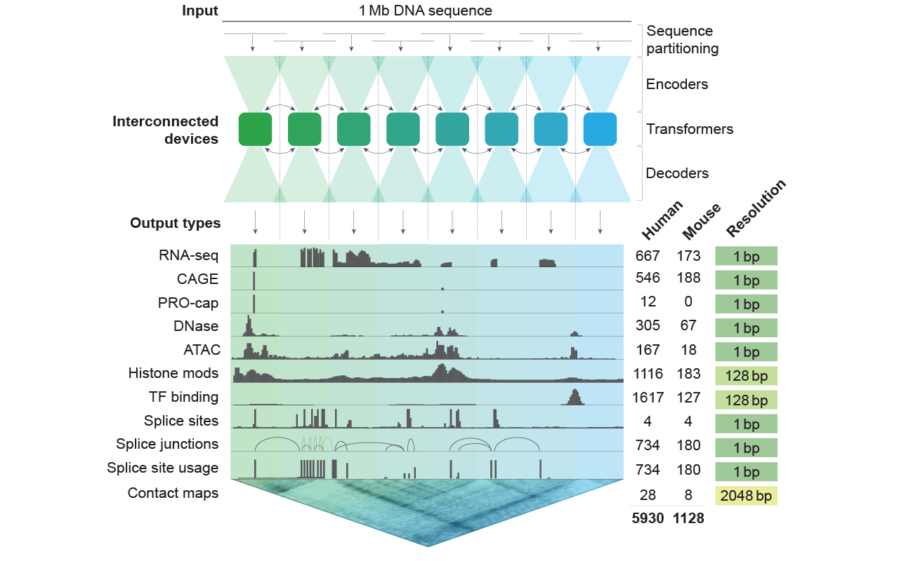

# AlphaGenome


[**Get API key**](https://deepmind.google.com/science/alphagenome) |
[**Quick start**](#quick-start) | [**Installation**](#installation) |
[**Documentation**](https://www.alphagenomedocs.com/) |
[**Community**](https://www.alphagenomecommunity.com) |
[**Terms of Use**](https://deepmind.google.com/science/alphagenome/terms)

The AlphaGenome API provides access to AlphaGenome, Google DeepMind’s unifying
model for deciphering the regulatory code within DNA sequences. This repository
contains client-side code, examples and documentation to help you use the
AlphaGenome API.

AlphaGenome offers multimodal predictions, encompassing diverse functional
outputs such as gene expression, splicing patterns, chromatin features, and
contact maps (see [diagram below](#model_overview)). The model analyzes DNA
sequences of up to 1 million base pairs in length and can deliver predictions at
single base-pair resolution for most outputs. AlphaGenome achieves
state-of-the-art performance across a range of genomic prediction benchmarks,
including numerous diverse variant effect prediction tasks (detailed in
[Avsec et al. 2025](https://doi.org/10.1101/2025.06.25.661532)).

The API is offered free of charge for
[non-commercial use](https://deepmind.google.com/science/alphagenome/terms)
(subject to the terms of use). Query rates vary based on demand – it is well
suited for smaller to medium-scale analyses such as analysing a limited number
of genomic regions or variants requiring 1000s of predictions, but is likely not
suitable for large scale analyses requiring more than 1 million predictions.
Once you obtain your API key, you can easily get started by following our
[Quick Start Guide](#quick-start), or watching our
[AlphaGenome 101 tutorial](https://youtu.be/Xbvloe13nak).

<a id='model_overview'>



</a>

The documentation also covers a set of comprehensive tutorials, variant scoring
strategies to efficiently score variant effects, and a visualization library to
generate `matplotlib` figures for the different output modalities.

We cover additional details of the capabilities and limitations in our
documentation. For support and feedback:

-   Please submit bugs and any code-related issues on
    [GitHub](https://github.com/google-deepmind/alphagenome/issues).
-   For general feedback, questions about usage, and/or feature requests, please
    use the [community forum](https://www.alphagenomecommunity.com) – it’s
    actively monitored by our team so you're likely to find answers and insights
    faster.
-   If you can't find what you're looking for, please get in touch with the
    AlphaGenome team on alphagenome@google.com and we will be happy to assist
    you with questions. We’re working hard to answer all inquiries but there may
    be a short delay in our response due to the high volume we are receiving.

## Quick start

The quickest way to get started is to run our example notebooks in
[Google Colab](https://colab.research.google.com/). Here are some starter
notebooks:

-   [Quick start](https://colab.research.google.com/github/google-deepmind/alphagenome/blob/main/colabs/quick_start.ipynb):
    An introduction to quickly get you started with using the model and making
    predictions.
-   [Visualizing predictions](https://colab.research.google.com/github/google-deepmind/alphagenome/blob/main/colabs/visualization_modality_tour.ipynb):
    Learn how to visualize different model predictions using the visualization
    libraries.

Alternatively, you can dive straight in by following the
[installation guide](#installation) and start writing code! Here's an example of
making a variant prediction:

```python
from alphagenome.data import genome
from alphagenome.models import dna_client
from alphagenome.visualization import plot_components
import matplotlib.pyplot as plt


API_KEY = 'MyAPIKey'
model = dna_client.create(API_KEY)

interval = genome.Interval(chromosome='chr22', start=35677410, end=36725986)
variant = genome.Variant(
    chromosome='chr22',
    position=36201698,
    reference_bases='A',
    alternate_bases='C',
)

outputs = model.predict_variant(
    interval=interval,
    variant=variant,
    ontology_terms=['UBERON:0001157'],
    requested_outputs=[dna_client.OutputType.RNA_SEQ],
)

plot_components.plot(
    [
        plot_components.OverlaidTracks(
            tdata={
                'REF': outputs.reference.rna_seq,
                'ALT': outputs.alternate.rna_seq,
            },
            colors={'REF': 'dimgrey', 'ALT': 'red'},
        ),
    ],
    interval=outputs.reference.rna_seq.interval.resize(2**15),
    # Annotate the location of the variant as a vertical line.
    annotations=[plot_components.VariantAnnotation([variant], alpha=0.8)],
)
plt.show()
```

## Installation

<!-- mdformat off(disable for [!TIP] format) -->

> [!TIP]
> You may optionally wish to create a
> [Python Virtual Environment](https://docs.python.org/3/tutorial/venv.html) to
> prevent conflicts with your system's Python environment.

<!-- mdformat on -->

To install `alphagenome`, clone a local copy of the repository and run `pip
install`:

```bash
$ git clone https://github.com/google-deepmind/alphagenome.git
$ pip install ./alphagenome
```

See [the documentation](https://www.alphagenomedocs.com/installation.html) for
information on alternative installation strategies.

## Citing `alphagenome`

If you use AlphaGenome in your research, please cite using:

<!-- disableFinding(SNIPPET_INVALID_LANGUAGE) -->

```bibtex
@article{alphagenome,
  title={{AlphaGenome}: advancing regulatory variant effect prediction with a unified {DNA} sequence model},
  author={Avsec, {\v Z}iga and Latysheva, Natasha and Cheng, Jun and Novati, Guido and Taylor, Kyle R. and Ward, Tom and Bycroft, Clare and Nicolaisen, Lauren and Arvaniti, Eirini and Pan, Joshua and Thomas, Raina and Dutordoir, Vincent and Perino, Matteo and De, Soham and Karollus, Alexander and Gayoso, Adam and Sargeant, Toby and Mottram, Anne and Wong, Lai Hong and Drot{\'a}r, Pavol and Kosiorek, Adam and Senior, Andrew and Tanburn, Richard and Applebaum, Taylor and Basu, Souradeep and Hassabis, Demis and Kohli, Pushmeet},
  year={2025},
  doi={https://doi.org/10.1101/2025.06.25.661532},
  publisher={Cold Spring Harbor Laboratory},
  journal={bioRxiv}
}
```

<!-- enableFinding(SNIPPET_INVALID_LANGUAGE) -->

## Acknowledgements

AlphaGenome communicates with and/or references the following separate libraries
and packages:

*   [Abseil](https://github.com/abseil/abseil-py)
*   [anndata](https://github.com/scverse/anndata)
*   [gRPC](https://github.com/grpc/grpc)
*   [immutabledict](https://github.com/corenting/immutabledict)
*   [intervaltree](https://github.com/chaimleib/intervaltree)
*   [jaxtyping](https://github.com/patrick-kidger/jaxtyping)
*   [matplotlib](https://matplotlib.org/)
*   [ml_dtypes](https://github.com/jax-ml/ml_dtypes)
*   [NumPy](https://numpy.org/)
*   [pandas](https://pandas.pydata.org/)
*   [protobuf](https://developers.google.com/protocol-buffers/)
*   [pyarrow](https://arrow.apache.org/)
*   [SciPy](https://scipy.org/)
*   [seaborn](https://seaborn.pydata.org/)
*   [tqdm](https://github.com/tqdm/tqdm)
*   [typeguard](https://github.com/agronholm/typeguard)
*   [typing_extensions](https://github.com/python/typing_extensions)
*   [zstandard](https://github.com/indygreg/python-zstandard)

We thank all their contributors and maintainers!

## License and Disclaimer

Copyright 2024 Google LLC

All software in this repository is licensed under the Apache License, Version
2.0 (Apache 2.0); you may not use this except in compliance with the Apache 2.0
license. You may obtain a copy of the Apache 2.0 license at:
https://www.apache.org/licenses/LICENSE-2.0.

Examples and documentation to help you use the AlphaGenome API are licensed
under the Creative Commons Attribution 4.0 International License (CC-BY). You
may obtain a copy of the CC-BY license at:
https://creativecommons.org/licenses/by/4.0/legalcode.

Unless required by applicable law or agreed to in writing, all software and
materials distributed here under the Apache 2.0 or CC-BY licenses are
distributed on an "AS IS" BASIS, WITHOUT WARRANTIES OR CONDITIONS OF ANY KIND,
either express or implied. See the licenses for the specific language governing
permissions and limitations under those licenses.

This is not an official Google product.

### Third-party software

Your use of any third-party software, libraries or code referenced in the
materials in this repository (including the libraries listed in the
[Acknowledgments](#acknowledgements) section) may be governed by separate terms
and conditions or license provisions. Your use of the third-party software,
libraries or code is subject to any such terms and you should check that you can
comply with any applicable restrictions or terms and conditions before use.

### Reference Datasets

A modified version of the GENCODE dataset (which can be found here:
https://www.gencodegenes.org/human/releases.html) is released with the client
code package for illustrative purposes, and is available with reference to the
following:

-   Copyright © 2024 EMBL-EBI
-   The GENCODE dataset is subject to the EMBL-EBI terms of use, available at
    https://www.ebi.ac.uk/about/terms-of-use.
-   Citation: Frankish A, et al (2018) GENCODE reference annotation for the
    human and mouse genome.
-   Further details about GENCODE can be found at
    https://www.gencodegenes.org/human/releases.html, with additional citation
    information at https://www.gencodegenes.org/pages/publications.html and
    further acknowledgements can be found at
    https://www.gencodegenes.org/pages/gencode.html.
